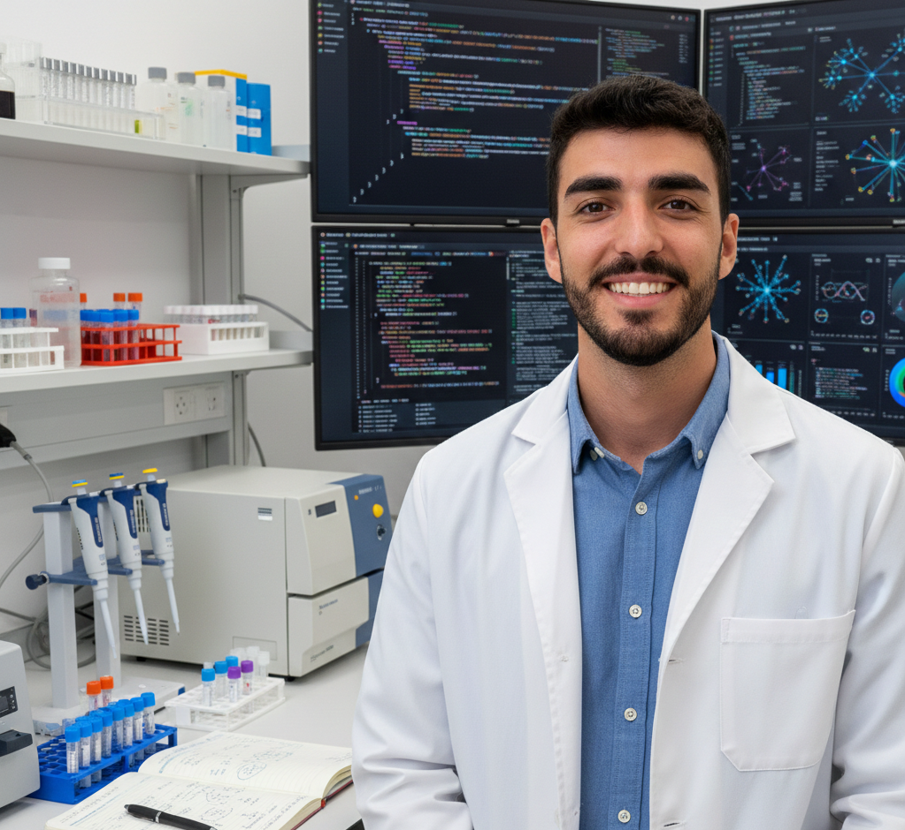

  
  

# 👋 Hola, soy Dani

  

## 📖 Sobre mí

Mi perfil es híbrido: apasionado por la **Ciencia de Datos** con un background en **Bioquímica**. Mi trabajo se centra en desarrollar soluciones inteligentes que combinan el análisis de datos masivos con el conocimiento científico profundo.

- 👨🏻‍💻 **Científico de Datos**: Especializado en la creación de pipelines de Machine Learning de extremo a extremo, NLP y Visión Artificial.
- 🧬 **Bioquímico e Inmunólogo**: Experto en el manejo y análisis de datos científicos complejos y bioinformática.
- 🌍 **Idiomas**: 
  - 🇪🇸 **Español**: Nativo.
  - 🇬🇧 **Inglés**: Profesional (C1/B2).
- ✉️ **Contacto**: [ausdanieldr@gmail.com](mailto:ausdanieldr@gmail.com)

---

## 💻 Tecnologías y Herramientas

### 🚀 Programación, IA y Ciencia de Datos

### 🧪 Análisis de Datos y Bioinformática

  
  
  
  
  
  
  
  

---

## 🧠 Mis Proyectos

| Proyecto | Descripción | Tecnologías |
| :--- | :--- | :--- |
| **[🛡️ Detección de Cyberbullying](./deteccion-cyberbullying/)** | Pipeline integral (End-to-End) para la detección de contenido ofensivo mediante NLP avanzado. Incluye preprocesamiento masivo, traducción automática y comparación de modelos. | `DistilBERT`, `NLP`, `Deep Learning`, `Scikit-learn` |
| **[👤 Controlador de Asistencia](./Controlador-Asistencia/)** | Sistema de biometría facial en tiempo real que identifica personas y registra asistencia automáticamente en archivos locales. | `OpenCV`, `Face Recognition`, `NumPy` |
| **[🎙️ Asistente Virtual](./Asistente-Voz/)** | Asistente inteligente de voz capaz de procesar lenguaje natural para ejecutar comandos y automatizar tareas mediante diversas APIs. | `Speech-to-Text`, `APIs`, `Python` |
| **[🕸️ Web Scraping](./Web-Scraping/)** | Herramientas de extracción de datos automatizada con lógica de paginación y descarga de archivos multimedia. | `BeautifulSoup`, `Requests`, `LXML` |
| **[🚀 Invasión Espacial](./Invasion-Espacial/)** | Videojuego clásico desarrollado bajo el paradigma de programación orientada a objetos (POO), gestionando colisiones y eventos en tiempo real. | `Pygame`, `OOP` |

---

## 🎩 Otros proyectos 

### Competición en iGEM (International Genetically Engineered Machine)
Proyecto innovador para reutilizar los residuos de aceites para crear biopintura.
- 🔗 [Página del proyecto iGEM 2021](https://2021.igem.org/Team:UMA_MALAGA)
- 🔗 [Reportaje Canal Sur](https://www.canalsur.es/television/programas/tesis/noticia/1774935.html)

### Beca voluntariado investigación en las Islas Galápagos (Ecuador)
- 🔗 [Ver experiencia en LinkedIn](https://www.linkedin.com/in/daniel-d%C3%ADaz-ruiz1/overlay/experience/2020672533/multiple-media-viewer/?profileId=ACoAADF2FIcBqw51PxIVU5dyb1w_68d5toAjiE0&treasuryMediaId=1635500169120)
